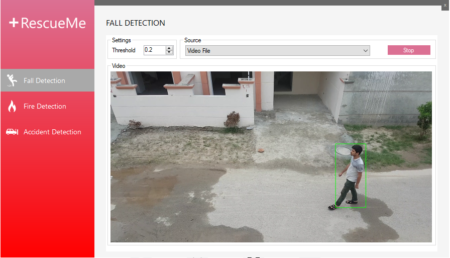

# RescueMe - Automate Emergency Medical Service (EMS) System

A computer-vision based system able to autonomously monitor people and detect critical situations associated with medical emergency such as fire, fall and car accident detection.

### Demo

